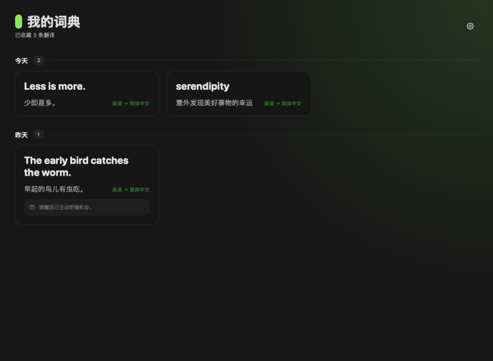
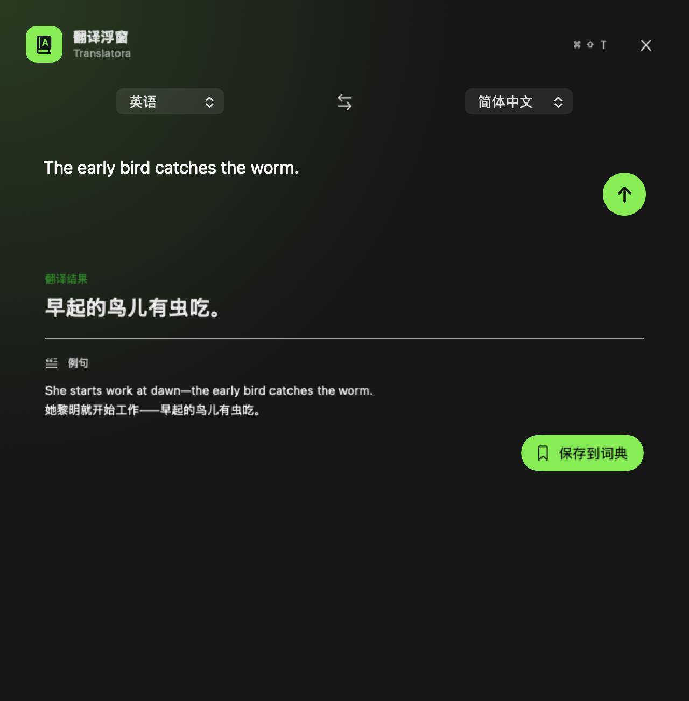
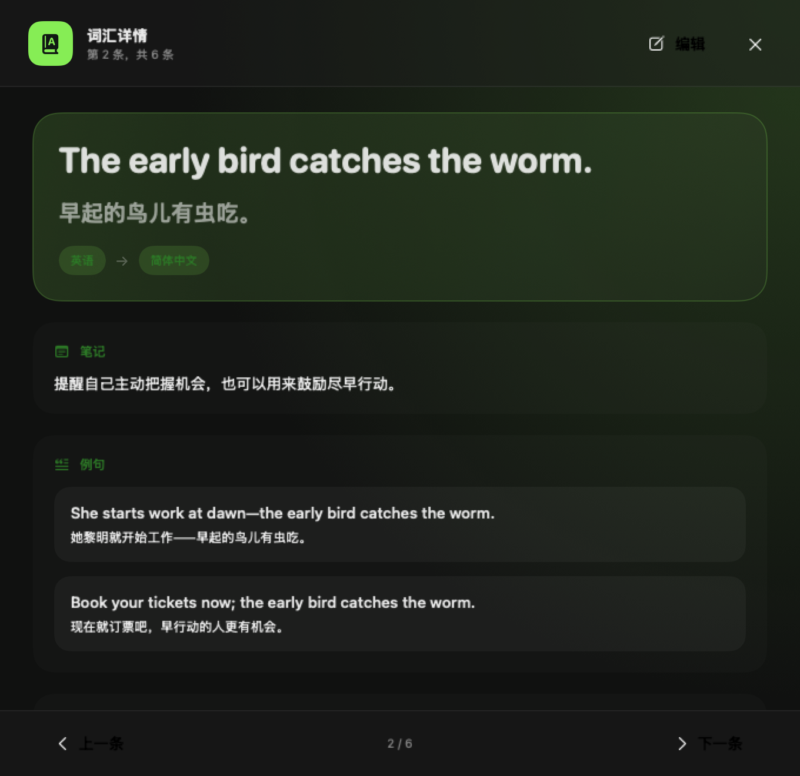

# Translatora

一款面向 macOS 的划词翻译与个人词典应用。选中其他应用中的文本，按下全局快捷键，即可在翻译浮窗中获得 AI 翻译和语境例句；有价值的表达可以继续收藏、补充笔记，沉淀到应用首页的词汇列表中。

> 当前仓库提供源码，需使用 Xcode 构建运行。应用要求 macOS 26.0 或更高版本，并需要自行配置 DeepSeek API Key。



## 它解决什么问题

阅读网页、文档或聊天内容时，复制文本、切换翻译工具、查看结果再回到原处，会打断当前工作。Translatora 把这段流程缩短为一次快捷键操作，并给常用表达提供一个继续整理的位置：

1. 在浏览器、文档或其他应用中选中文本。
2. 按下 `⇧⌘T`，翻译浮窗会读取选中内容并自动开始翻译。
3. 查看译文与例句；也可以手动输入文本、切换语言或交换翻译方向。
4. 点击「保存到词典」，将结果加入应用首页的词汇列表。
5. 打开词汇详情，继续编辑原文、译文、语言、例句和个人笔记。

翻译浮窗也支持纯手动输入。未授予辅助功能权限时，仍可把它当作一个随时呼出的轻量翻译窗口使用。

| 翻译浮窗 | 词汇详情 |
| :---: | :---: |
|  |  |

## 核心功能

### 随处呼出的翻译浮窗

- 默认全局快捷键为 `⇧⌘T`，可在设置中录制新的组合键。
- 自动读取当前应用中选中的文本并立即翻译。
- 支持手动输入、源语言与目标语言选择，以及一键交换翻译方向。
- 翻译结果包含自然译文，并按内容提供 1–2 条双语例句。
- 支持英语、简体中文、繁体中文、日语、韩语、法语、德语和西班牙语互译。
- 按 `Esc` 或再次使用快捷键即可关闭翻译浮窗。

### 可以继续整理的词汇列表

- 在翻译浮窗中主动收藏需要保留的结果。
- 应用首页按「今天 / 昨天 / 日期」分组展示词汇。
- 词汇卡片同时呈现原文、译文、语言方向和笔记摘要。
- 词汇详情支持前后浏览，并可编辑原文、译文、语言、例句与笔记。
- 支持删除不再需要的记录，所有改动会立即写入本地词典文件。

### 按自己的习惯使用

- 外观可选跟随系统、浅色或深色模式。
- 翻译服务可选 `DeepSeek V4 Flash` 或 `DeepSeek V4 Pro`；代码当前默认使用 Flash。
- 可在设置中测试 API 连接、修改全局快捷键并查看辅助功能权限状态。
- 界面使用 macOS 26 的 Liquid Glass 风格。

## 从源码开始使用

### 环境要求

- macOS 26.0+
- Xcode 26+
- 一个可用的 [DeepSeek 开放平台](https://platform.deepseek.com/) API Key

### 构建并运行

```bash
git clone https://github.com/Carri1Sun/Translatora.git
cd Translatora
open Translatora.xcodeproj
```

在 Xcode 中选择 `Translatora` Scheme 与本机运行目标，然后按 `⌘R`。也可以通过命令行完成构建：

```bash
xcodebuild \
  -project Translatora.xcodeproj \
  -scheme Translatora \
  -destination 'platform=macOS' \
  CODE_SIGNING_ALLOWED=NO \
  build
```

### 首次配置

1. 启动后点击应用首页右上角的齿轮，或按 `⌘,` 打开设置。
2. 填入 DeepSeek API Key，选择模型，点击「测试连接」，成功后保存。
3. 如需划词翻译，在「选中文本」区域请求辅助功能权限；也可以前往「系统设置 → 隐私与安全性 → 辅助功能」手动授权。
4. 回到任意应用选中文本，按 `⇧⌘T` 开始第一次翻译。

如果快捷键与其他应用冲突，可在设置中点击当前快捷键并直接录制新的组合。组合中至少需要一个修饰键。

## 数据与隐私

- 收藏的词汇保存在 `~/Library/Application Support/Translatora/dictionary.json`，应用没有账号体系或云同步。
- API Key 保存在当前用户的本地偏好设置中。现阶段尚未接入 Keychain，建议只在可信设备上使用。
- 发起翻译时，输入文本会发送到配置的 DeepSeek API；词汇笔记和已经收藏的词汇不会自动上传。
- 辅助功能权限用于读取其他应用的选中文本。读取过程会触发复制操作，并在完成后恢复原有剪贴板内容。

## 技术架构

Translatora 使用 SwiftUI + Combine 开发，依赖 AppKit、Carbon 和 ApplicationServices 等 macOS 系统框架，没有第三方运行时依赖。

```text
全局快捷键 ── GlobalHotKeyMonitor
                    │
                    ▼
选中文本 ── SelectedTextReader ── TranslationPanelController
                                      │
                                      ▼
                            TranslationPanelViewModel
                                 │            │
                                 ▼            ▼
                        TranslationService  DictionaryStore
                                 │            │
                                 ▼            ▼
                         DeepSeekProvider  dictionary.json
```

主要分层：

- `Views`：应用首页、翻译浮窗、词汇详情与设置界面。
- `Services`：快捷键监听、选中文本读取、翻译请求、面板生命周期和本地词典持久化。
- `Models`：语言、翻译结果、词汇条目、外观、快捷键与模型配置。
- `AppDependencies`：创建并连接应用级服务，统一管理生命周期与共享状态。

## 测试

```bash
xcodebuild \
  -project Translatora.xcodeproj \
  -scheme Translatora \
  -destination 'platform=macOS' \
  CODE_SIGNING_ALLOWED=NO \
  test
```

测试覆盖翻译响应解析、翻译浮窗状态、本地词典持久化、外观设置、剪贴板恢复，以及主要界面的渲染冒烟检查。README 中的产品截图由这些真实 SwiftUI 视图渲染生成。

## 项目结构

```text
Translatora/
├── Models/                 # 领域模型与配置模型
├── Services/               # 翻译、存储、快捷键和选中文本读取
├── Views/                  # 翻译浮窗、词汇详情与设置
├── AppDependencies.swift   # 应用依赖与生命周期协调
├── ContentView.swift       # 应用首页与词汇列表
└── TranslatoraApp.swift    # 应用入口与菜单命令
TranslatoraTests/           # 单元测试与渲染冒烟测试
docs/                       # 产品约定、维护记录与 README 图片
```

产品沟通中的统一名称为「应用首页」「词汇列表」「翻译浮窗」，详细定义见 [docs/naming-conventions.md](docs/naming-conventions.md)。
